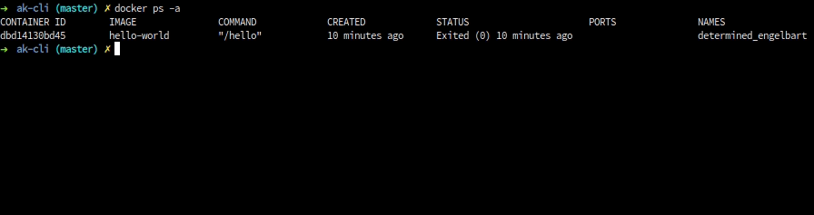

### Deletes docker container

`docker rm {{CONTAINER_NAME}}`

- <b>CONTAINER_NAME: </b>Container name or Container ID to delete

#### Example:

`docker rm ak-cli`

 

#### Related Commands

- [Create container using image](docker-container-create.md)
- [List Containers](docker-container-list.md)