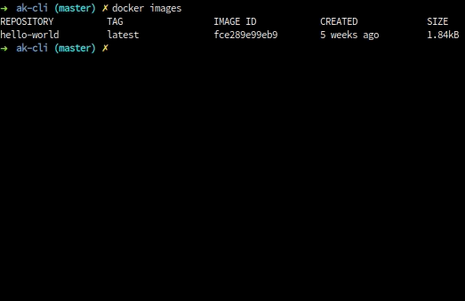

### Deletes docker image

`docker rmi {{IMAGE_NAME}}`

- <b>IMAGE_NAME: </b>Image name or Image ID to delete

#### Example:

`docker rmi ak-cli-image`

 

#### Related Commands

- [List Images](docker-images-list.md)