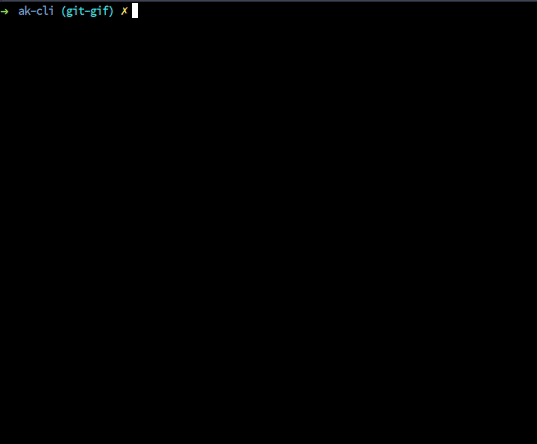

### Get stashed changes back

To get the latest stashed changes

`git stash pop`

### To get the specific stash

`git stash apply stash@{INDEX}`

- <b>INDEX: </b> Index of the stash, the index can be found using [stash list](git-stash-list.md) command

### Demo

  

### Related

- [Check status](git-status.md)
- [Stash](git-stash.md)
- [Stash File](git-stash-file.md)
