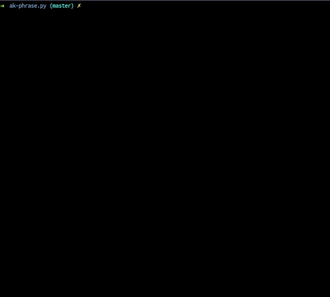

### Build python code to dist package

`python3 {{SETUP_FILE}} sdist bdist_wheel`

- <b>SETUP_FILE: </b> Name or location of setup file of the project.

#### Example:

`python3 setup.py sdist bdist_wheel`

  

#### Related

- [Python deploy to pypi](python-deploy-pypi.md)